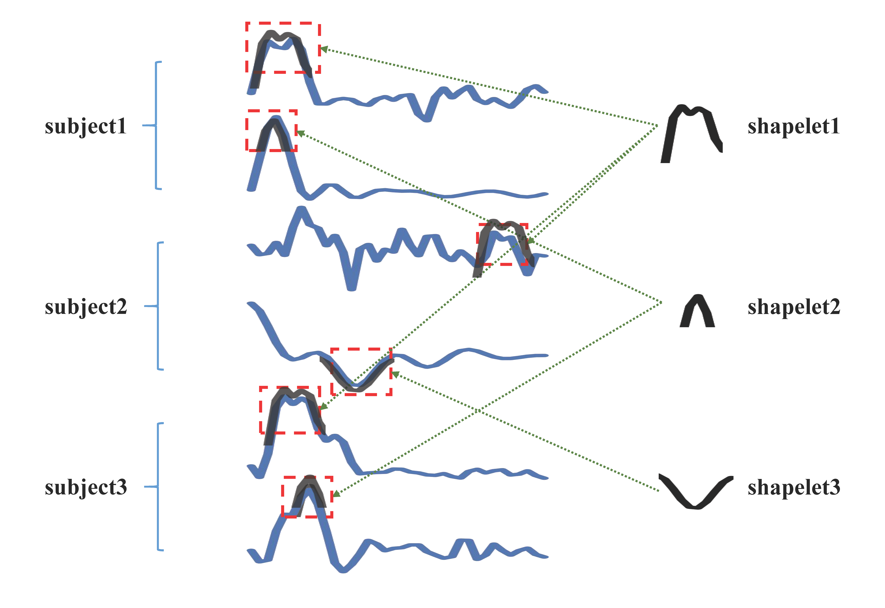

# Heterogeneous_Graph

An implement, updating.

# Requirements

- Anaconda3 (python 3.8)
- Pytorch 1.10
- transformers 4.44.0
  ...

# Function
HGRL-master is used to obtain heterogeneous graph and final predictions, TCSA-master is used to obtain MTS representations and similarity graph, and sub_shapelets-master is used to obtain shapelets and sub-matrices of heterogeneous graph.

# Easy Train

`python HGRL-master/HGRL-master/model/code/train.py`

You may change the dataset by modifying the variable "dataset = ''" in the top of the code "train.py" or use arguments (see train.py).

Our datasets can be downloaded from [Google Drive](https://drive.google.com/drive/folders/1-ivwhuy3YSDK_9wUI5ArcvHQubvNH6SZ?usp=drive_link).

See the codes for more details.
  
# Prepare data

* To run TCSA-master/representationlearn.py to get MTS representations and DTW matrix.
* To run sub_shapelets-master/main_findshapelets.py getting shaplets.
* To run sub_shapelets-master/findsubfeature.py getting subject features.
* To run sub_shapelets-master/findtime_sub.py
* or /findtime_sub
* or /findtime_shape
* or /findsub_sub
* or /findsub_shape
* or /findshapshape getting relationship matrix between MTS, subjects, shapelets.
* To run HGRL-master/bulidgraph.py getting final heterogeneous graph.
* To run HGRL-master/creatdataset/load_ratio_data.py getting training, validation, and test indexes.

# Prepare for your dataset

For trainning, the following files are required.

**For processed datasets, you can find in:**

sub_shapelets-master/demo/multivariate_datasets_supervise/dataset.npy

**For all processed data, you can find in:**

HGRL-master/multivariate_datasets/

* ----datasets_dtw/dataset.npy               // the dtw similarity matrix
* ----finalmatrix//dataset.npy   // final heterogeneous graph
* ---- map/dataset                     // the index of the training, validation, testing, node
* ---- representation/best_rep_dadaset.pt         // the learned MTS representation
* ---- shape_shape/dataset_shapshape.npy       // the relationship between shapelets
* ---- shapelets/dataset_shaplets.npy       // the learned shapelets
* ---- sub_shape/dataset_subshape.npy       // the relationship between subjects and shapelets
* ---- sub_sub/dataset_subsub.npy       // the relationship between subjects
* ---- subject_feature/dataset_subfeature.npy       // the learned subject label features
* ---- time_shape/dataset_timeshape.npy       // the relationship between MTS and shapelets
* ---- time_sub/dataset_timesub.npy       // the relationship between time and subjects

